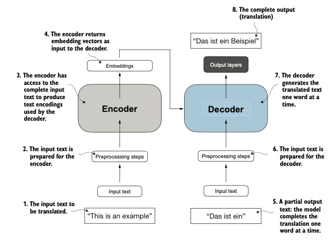
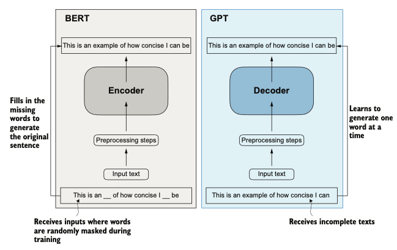
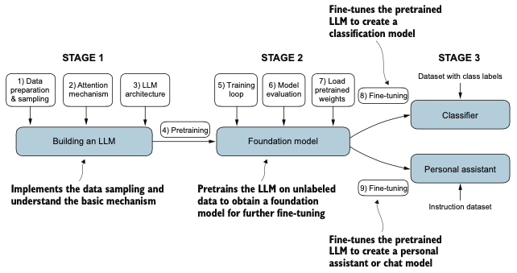

# 📚 Chapter 1: Introduction to Large Language Models  

Chapter 1 provides a concise yet insightful overview of **large language models (LLMs)** and their foundational concepts. It covers:  

- **Transformers, BERT, and GPT:**  
  Explains their key features, differences, and how they are interconnected.  

- **Architecture Diagrams:**  
  Includes clear and detailed diagrams illustrating the architectures of Transformer, BERT, and GPT models.  

- **Building an LLM:**  
  Offers an overview architectural diagram showcasing the various components involved in building a large language model, setting the stage for the topics explored throughout the book.  

This chapter serves as a comprehensive introduction, ensuring readers gain a strong foundational understanding before diving deeper.  

  
*Figure 1: Transformer*

  
*Figure 2: BERT & GPT*

  
*Figure 3: LLM stages*

---

# Interview Concepts: BERT, GPT, and Transformers

Answers to common interview questions about **BERT**, **GPT**, and **Transformers**. 

---
## 1. Transformer Architecture

### Self-Attention Mechanism
- **What is self-attention, and how does it work?**
  - Self-attention allows a model to weigh the importance of different words in a sequence **relative to each other**.
  - It computes a weighted sum of the embeddings of all words in the sequence, where the weights are determined by the similarity between the word and every other word.

- **How does self-attention differ from traditional attention mechanisms?**
  - Traditional attention mechanisms compute attention between **two different sequences** (e.g., encoder and decoder).
  - Self-attention computes attention **within the same sequence**, capturing dependencies between all words.

- **What are queries (Q), keys (K), and values (V)?**
  - These are <u>learned linear transformations</u> of the input embeddings.
  - **Q**: Represents the word we are focusing on.
  - **K**: Represents the words we are comparing against.
  - **V**: Represents the information we aggregate based on the attention scores.

- **Why is scaling used in dot-product attention?**
  - Scaling prevents the dot products from becoming too large, which can lead to small gradients during training.

---

### Multi-Head Attention
- **What is multi-head attention, and why is it used?**
  - Multi-head attention splits the input into multiple "heads," each computing self-attention independently.
  - This allows the model to focus on different parts of the sequence simultaneously, capturing diverse relationships.

---

### Positional Encoding
- **Why do Transformers need positional encoding?**
  - Transformers lack recurrence or convolution, so they have no inherent notion of word order.
  - Positional encoding adds information about the position of each word in the sequence.
  - Without positional encoding, the model would treat the input sequence as a bag of words, losing all information about the order of tokens. Example: The sentences "The cat chased the dog" and "The dog chased the cat" would be treated identically without positional information.
   - Self-Attention is *Permutation-Invariant* (means that shuffling the tokens in a sequence would produce the same attention scores).

- **How is positional encoding added?**
  - It is added to the input embeddings using sine and cosine functions of different frequencies:
    \[
    PE_{(pos, 2i)} = \sin\left(\frac{pos}{10000^{2i/d}}\right), \quad PE_{(pos, 2i+1)} = \cos\left(\frac{pos}{10000^{2i/d}}\right)
    \]

---

### Layer Normalization and Residual Connections
- **What is the role of layer normalization?**
  - It stabilizes training by normalizing the inputs across the features dimension.

- **Why are residual connections (a.k.a skip connections) important?**
  - These are are shortcuts that bypass one or more layers in a neural network. They help mitigate the vanishing gradient problem and enable training of very deep networks.

---

## 2. BERT (Bidirectional Encoder Representations from Transformers)

### Key Features
- **Why is BERT bidirectional?**
  - BERT uses bidirectional context (both left and right) to understand the meaning of a word, unlike GPT, which is unidirectional.

- **What is the difference between pre-training and fine-tuning?**
  - Pre-training trains the model on a large corpus (e.g., Masked Language Modeling).
  - Fine-tuning adapts the model to a specific task (e.g., sentiment analysis).

---

### Pre-Training Tasks
- **Masked Language Modeling (MLM):**
  - Randomly masks 15% of the tokens and predicts them using context from both directions.

- **Next Sentence Prediction (NSP):**
  - Predicts whether two sentences appear consecutively in the text.

- **How to evaluate effectiveness of pre-trained model?**
  - Intrinsic Evaluation: Assess the quality of learned representations (e.g., perplexity, masked token accuracy).
  - Extrinsic Evaluation: Fine-tune the model on downstream tasks and evaluate performance (e.g., accuracy, F1-score).
  - Transfer Learning Evaluation: Test the model’s ability to adapt to new domains or languages.
  - Robustness and Generalization: Evaluate the model’s performance on noisy, adversarial, or out-of-distribution data.
  - Efficiency and Scalability: Measure inference speed and memory usage.

---

## 3. GPT (Generative Pre-trained Transformer)

### Key Features
- **How does GPT differ from BERT?**
  - GPT is unidirectional (left-to-right) and uses causal language modeling (CLM) for pre-training.

- **What is the pre-training objective?**
  - Predict the next word in a sequence, given all previous words.

---

### Fine-Tuning
- **How is GPT fine-tuned?**
  - Fine-tuning involves training on task-specific data (e.g., text classification) using supervised learning.

---

### Misc
- **Explain LoRA and Mixture-of-experts**

*LoRA:*
  - LoRA (Low Rank Adaptation) is an effIcient way of finetuning pre-trained models.
  - Updating all weight parameters of a large model is computationally expensive. Instead of updating the full weight matrix, this technique approximates the updates using low-rank matrices.
  - By reducing the number of parameters to update, LoRA significantly reduces memory and computational costs compared to full fine-tuning.
  - USE WHEN: Use when you need to fine-tune large models for specific tasks with limited computational resources.

*Mixture of experts:*
  - Mixture of Experts is a neural network architecture designed to scale model capacity efficiently by dividing the model into smaller, specialized sub-networks (experts). 
  - Each expert handles a subset of the input data, and a gating mechanism determines which experts to activate for a given input.
  - The gating network outputs a probability distribution over the experts, and only the top-k  experts are activated (sparse activation)
  - USE WHEN: Use when building very large models that require high capacity and can benefit from sparse computation.
